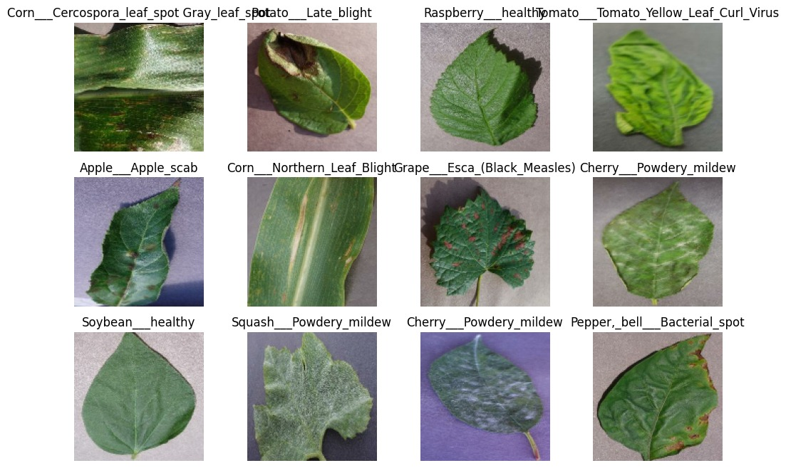
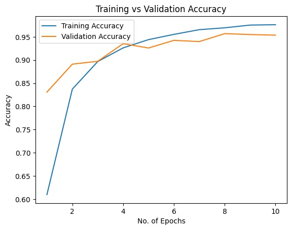
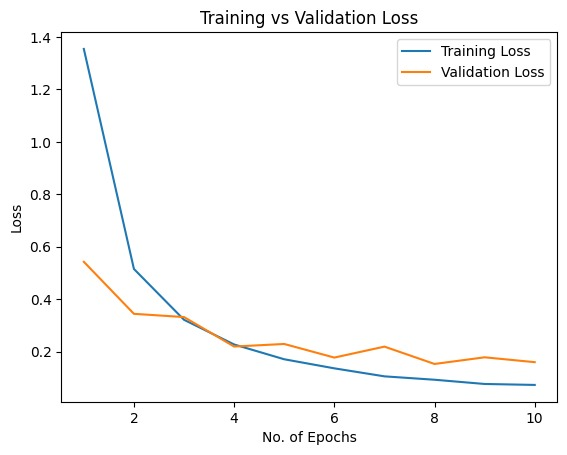
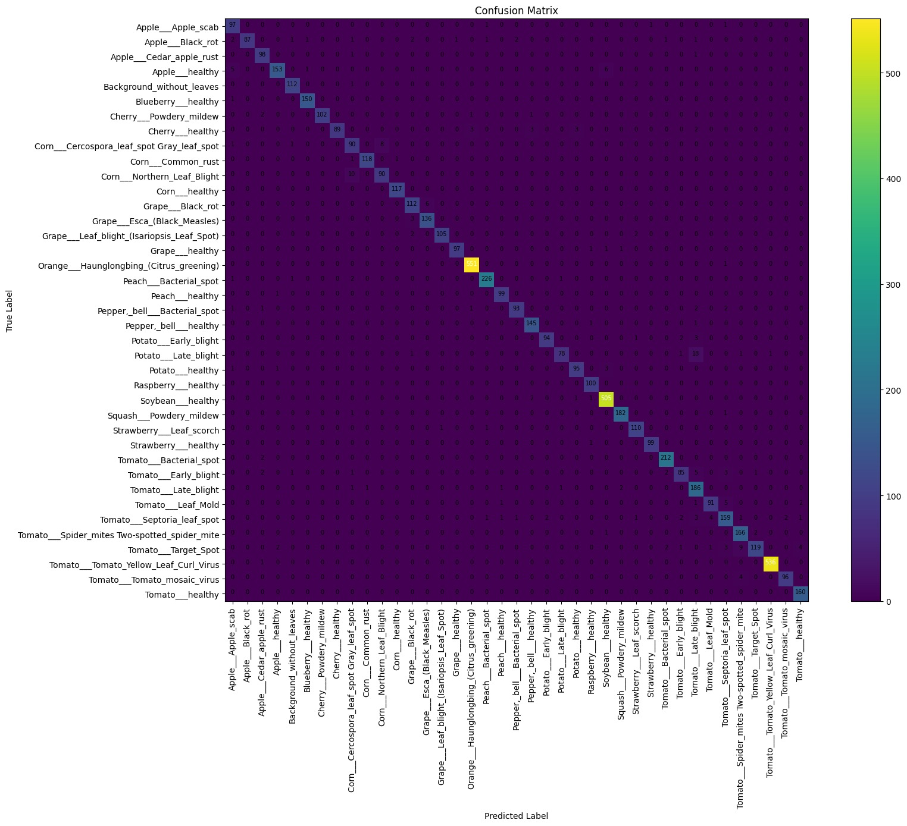

# 🌿 Plant Disease Detection System

This project is a deep learning based web application that detects plant diseases from leaf images.  
Users can upload a plant leaf image and the system predicts the disease along with confidence scores and the top-5 predictions.

The goal of this project is to demonstrate how computer vision and deep learning can help in early plant disease detection.

🔗 **Live Application**  
https://leafscan-kulbhushan.streamlit.app/

---

# 📌 Project Overview

Plant diseases are one of the major causes of crop loss worldwide. Early detection allows farmers to take preventive action and reduce damage.

In this project, I trained a **Convolutional Neural Network (CNN)** to classify plant diseases from leaf images. The trained model is integrated into a **Streamlit web application** where users can upload images and get predictions instantly.

The system also generates a **downloadable diagnostic report in PDF format** summarizing the prediction results.

---

# 🚀 Key Features

• Upload leaf images for diagnosis  
• CNN-based plant disease prediction  
• Confidence score for predictions  
• Top-5 predicted classes  
• Downloadable AI diagnostic PDF report  
• Clean UI built using Streamlit  
• Real-time inference pipeline  

---

# 🧠 Model Details

**Model Type**  
Convolutional Neural Network (CNN)

**Framework**  
TensorFlow / Keras

**Dataset**

• 61,000+ plant leaf images  
• 39 plant disease classes  

**Performance**

• **95.35% validation accuracy**

Model evaluation included:

• Confusion Matrix  
• Training vs Validation Accuracy  
• Training vs Validation Loss  
• Testing on **6000+ unseen images**

---

# 🖼 Dataset Sample



Example images from the dataset showing different crops and disease types used during model training.

---

# 📊 Model Training Results

## Training vs Validation Accuracy



The model shows stable convergence with increasing validation accuracy across epochs.

---

## Training vs Validation Loss



Loss decreases consistently, indicating effective learning and minimal overfitting.

---

# 🔎 Confusion Matrix



The confusion matrix shows strong classification performance across the majority of plant disease classes.

---

# 📄 Sample AI Diagnostic Reports

The system automatically generates a downloadable PDF report after prediction.

Example reports:

- [Sample Report 1](reports/Plant_Disease_Report%20(sample%20report%201).pdf)
- [Sample Report 2](reports/Plant_Disease_Report%20(sample%20report%202).pdf)

Each report includes:

• Predicted disease  
• Confidence score  
• Top-5 predictions  
• Timestamp  
• AI generated report disclaimer  

---

# 🧰 Tech Stack

**Programming Language**

Python

**Machine Learning**

TensorFlow  
Keras  

**Libraries**

NumPy  
Pillow  

**Web Application**

Streamlit  

**PDF Generation**

ReportLab  

**Deployment**

Streamlit Cloud

---

# ⚙️ How the System Works

1. User uploads a leaf image.
2. The image is resized and preprocessed.
3. The CNN model performs inference.
4. The model predicts the disease class.
5. The application displays:
   - predicted disease
   - confidence score
   - top-5 predictions
6. A PDF diagnostic report can be downloaded.

---

# 📂 Project Structure

```
plant-disease-detection

plant-disease-app
│
├── app.py
├── class_names.json
├── requirements.txt

trained_model.keras
README.md
```

---

# ▶️ Running the Project Locally

Clone the repository

```
git clone https://github.com/yourusername/plant-disease-detection.git
cd plant-disease-detection
```

Install dependencies

```
pip install -r requirements.txt
```

Run the application

```
streamlit run app.py
```

---

# ⚠️ Disclaimer

This system provides predictions using a trained machine learning model.  
The results should be considered as **decision support** and verified by an agricultural expert before taking action.

---

# 👨‍💻 Author

**Kul Bhushan Kotagiri**

Interested in AI, Machine Learning, and Computer Vision applications that solve real-world problems.
